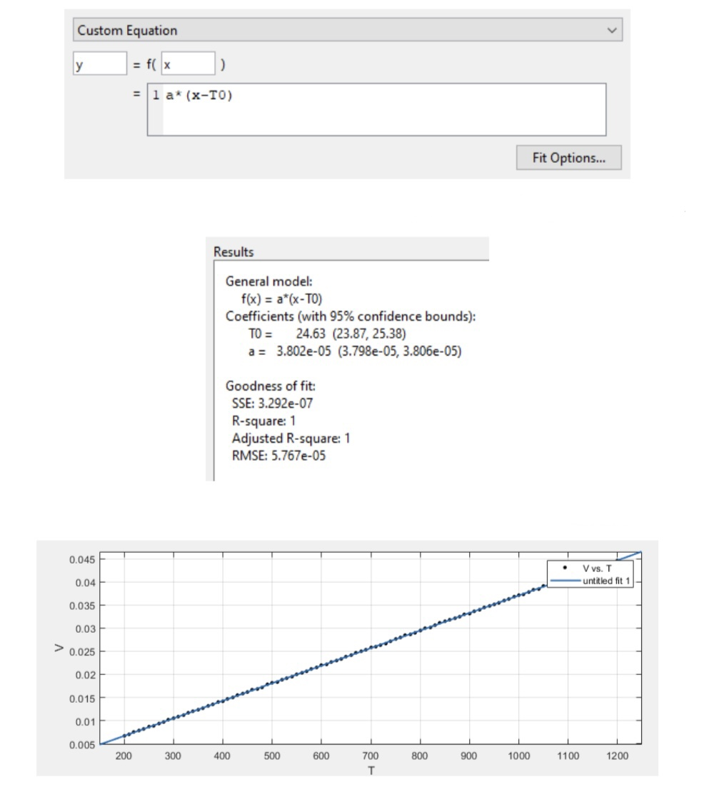

# RTD-Thermistor_Thermocouple
Design of RTD, Thermistor, and Thermocouple sensors based on datasets of temperatures and equivalent resistance values.

1- RTD:

First, we find the coefficients of the equation by using the RTD.mat file, and cftool in MATLAB (using the least squares method).

It is shown that the value of alpha is equal to 0.0067, so the corresponding metal used in the sensor is Nickel, according to the table below:

The RTD circuit is as follows:

In the next step, a circuit is designed to convert the output of the sensor to a voltage in the range of 0 to 10 volts. The circuit is then tested in Proteous application as below:

2- Thermistor:

The coefficients of the equation by using the Thermistor.mat file, and cftool in MATLAB:

By writing the coresponding equations, we find the values of each component in the circuit:

The circuit is designed to convert the output of the sensor to a voltage in the range of 0 to 10 volts. The circuit is then tested in Proteous application as below:

3- Thermocouple:

The coefficients of the equation by using the Thermistor.mat file, and cftool in MATLAB:

The equation above can be later used to design the corresponding circuit. The circuit is designed to convert the output of the sensor to an electric current in the range of 4 to 20 ampers. The circuit is later tested in Proteous application:

